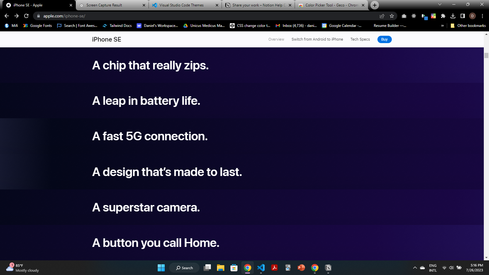
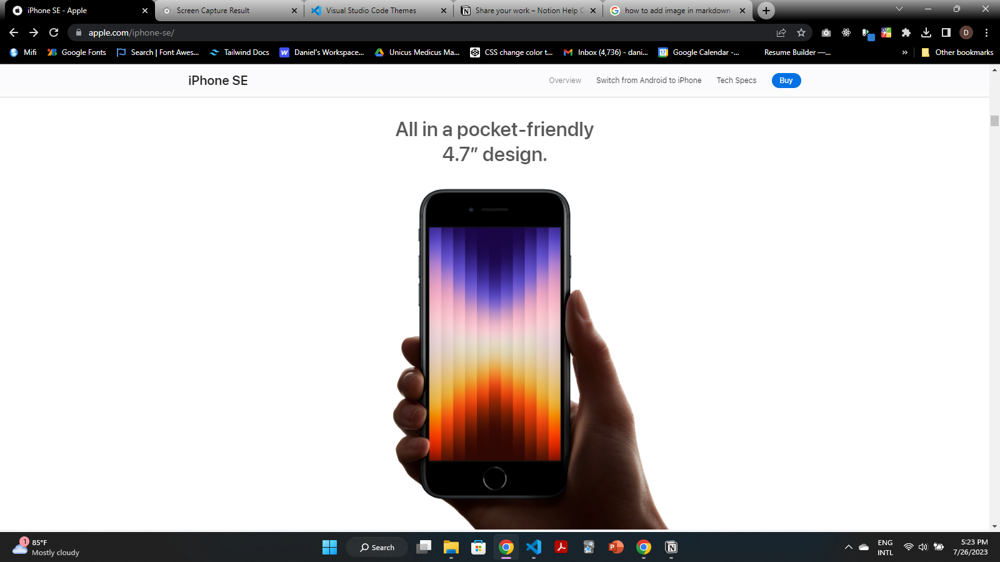
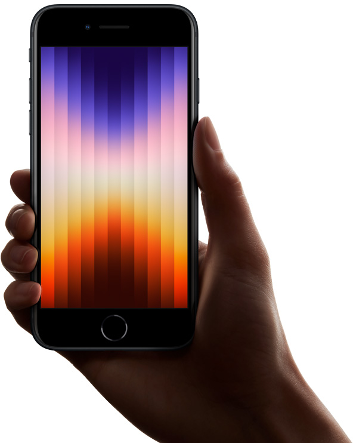

# Materials for Iphone SE website project.

## Generals
- Primary Blue: #0071e3
- link blue: #2d7fd2

## Navbar
- font-family: "SF Pro Text","SF Pro Icons","Helvetica Neue","Helvetica","Arial",sans-serif
- font-size: 1em
- text hover color: #06c
* Logo font size: 21px.
* Logo font family: Same as base.

## Hero
- Hero subhead text gradient: **linear-gradient(90deg,#173597,#2c5de2)**
- paragraph text color: #6e6e73

## This part

- font-size: 40px
- Omo, those gradients.I don't know yet o.

* * *

## This part 

- font size: 32px
- color: #58585a
- We'll need this too.

***
## 'Fast runs in the family' section
- You'll need this

- h3 font gredient: linear-gradient(90deg,#9f310e,#e34912)
- font-size: 96px
- paragraph font color: 7e7e80
- paragraph font size: 32px

# *Hey, Just noticed I can easily download all the the files for the web page just by downloading the page. Damnn. I want to cry.*
All files for images are here. 
**./images/iPhone SE - Apple_files**

I don tire sef, I'll continue another day.